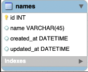
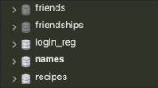

# MySQL Workbench - Setup

## Querying a Database for a CRUD Application
**CRUD** stands for **Create**, **Read**, **Update** and **Delete**. These are the four main ways we interact with a database. If you are dealing with a SQL database, this involves the commands **INSERT**, **SELECT**, **UPDATE**, and **DELETE** which you've already read about. For this assignment, you will use MySQL workbench to create an ERD model, then forward engineer it to create a database. Next, you will query the database using SQL commands. These are the commands you would use to create a CRUD application, or an application where you can manipulate data stored in a database.

First, create a new ERD model called names, that is, change it from the default **my_db**! Create a new diagram for a table also called names like below:

Next you will forward engineer your model to create a database. Then go ahead and complete all the CRUD queries, by completing the assignment tasks. To submit, create a text file and copy and paste commands you used to query the database. Upload the text file below.

### Helpful Tips

- Once you've forward engineered your database, and navigated to your local instance, you may not see it in your list of schemas right away. If not, hit the refresh icon, and it should appear.

    

- Whenever you write a query in MySQL workbench, it will execute it on the selected database. The only indication of which database is selected is that it is in bold. In order to execute any queries, be sure you have double-clicked the name of the schema, or database, you want to use. In the example below the "names" database is selected.

    

- **_Remember:_** It's always okay to look up the syntax for SQL statements whenever you forget. In fact, looking up syntax is very commonplace even for seasoned developers, especially those that don't tend to use SQL every day. The important part is to become familiar with how databases are structured and be able to query a database to fetch and alter the data you want.