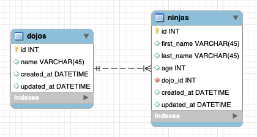

# Dojos and Ninjas

In the previous chapter, you created the **dojos_and_ninjas_schema**. Now, you'll get the chance to forward engineer this schema, and use queries to manipulate the database. Try to put yourself in the mindset of a software engineer working at Coding Dojo. In this role, you need to manage the data Coding Dojo has on their Dojo locations, and the Ninjas who take classes at each site.

