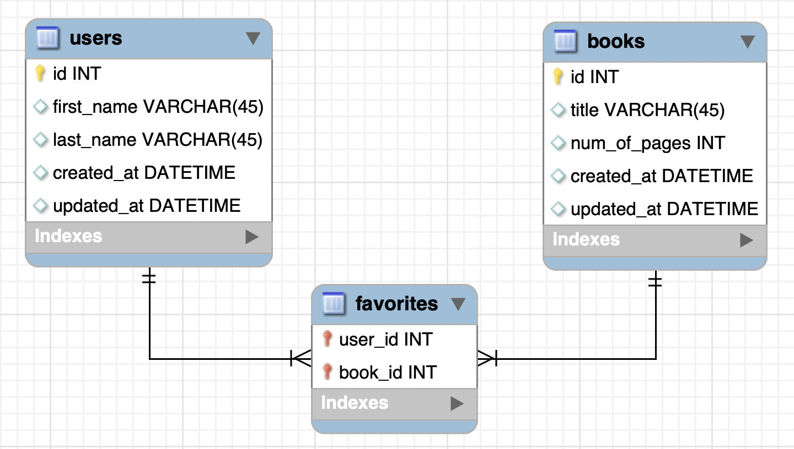

# Books

In the previous chapter, you created the **books_schema**. Now, you'll get the chance to forward engineer this schema, and use queries to manipulate the database. Imagine you're in charge of maintaining a database of users and books for an online book retailer. In this role, you need to manage the data that is displayed, including the books each user has favorited, the all the users that have favorited a particular book.

