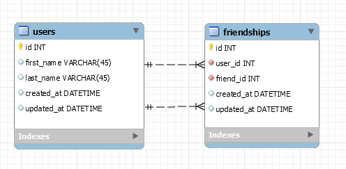

# Friendships

In the previous chapter, you created the **friendships_schema**. Now, you'll get the chance to forward engineer this schema, and use queries to manipulate the database. Imagine you're in charge of maintaining the database of a new social networking site! In this role, you need to manage the data that is displayed, including who users consider their "friends" online.



After adding users to the database and creating some relationships, your results should look like below:

| first_name | last_name | friend_first_name | friend_last_name |
|  :------:  | :------:  |     :-------:     |     :------:     |
|     Amy    |   Giver   |        Eli        |      Byers       |
|     Amy    |   Giver   |        Big        |       Bird       |
|     Amy    |   Giver   |       Kermit      |     The Frog     |
|     Eli    |   Byers   |       Kermit      |     The Frog     |
|     Eli    |   Byers   |       Marky       |       Mark       |
|    Marky   |    Mark   |        Big        |       Bird       |


Your actual query will look something similar to this:

```sql
SELECT * FROM users 
JOIN friendships ON ____=____ 
LEFT JOIN users as user2 ON ____ = ____;
```


Take note that we're joining the users table again but we're specifying the second users table as `user2`.  You can then reference the second users by calling `user2` (e.g. `user2.id`, `user2.first_name`, etc).  

You can also rename the fields that are displayed on the result by using the as keyword, like the below example:   

```sql
SELECT user2.first_name as friend_first_name, user2.last_name as friend_last_name, ...  FROM ...
```

Knowing how to do joins can be tricky but is used quite often and will most likely appear again in your belt exam.